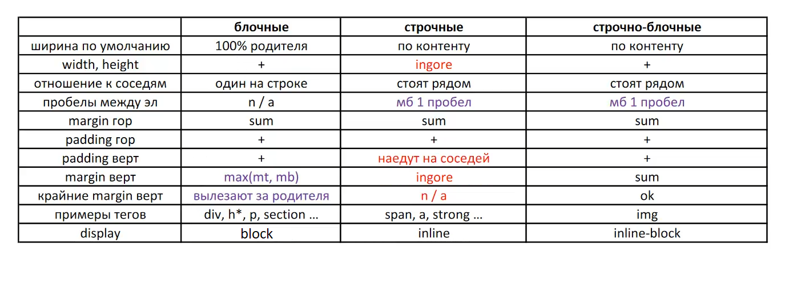

# Блочная модель
У каждого тега в HTML, по-умолчанию свой `display`.
- перенос строк которые не вмещяются в контейнер: word-break: break-all, overflow-wrap: break-word.
- блочные теги обычно используют для вёрстки, строчные теги для форматирования текста.
- чтобы убрать пробел у изображения, `inline` или у `inline-block`, нужно обнулить `line-height` элементу или его контейнеру.
- `margin` по горизонтали, у соседних элементов суммируются у всех.
- `padding` по горизонтали, у соседних элементов суммируются у всех.
- `margin` по вертикали, у блочных элементов выбирается наибольший `margin` (специально сделано для контента: заголовки, абзацы и т.д.), строчные игнорируют, `inline-block` суммируют.

https://doka.guide/css/vertical-align/  
Выравниваем строчно-блочные элементы по вертикали:
- прописываем всем элементам `display: inline-block`
- прописываем всем элементам `vertical-align: middle`

Таблица с параметрами блочной модели:

- Блочные `block`
- Строчные `inline`
- Строчно-блочные `inline-block`, хорошо работает с псевдоэлементами.

## Убираем пробелы
Пробелы видны в инспекторе фаерфокса, там же можно узнать высоту и ширину пробела.

Пробелы образуются от переноса строки в коде, например.
Обнуляем высоту шрифта, в коде убираем перенос строки, не закрываем теги `li` (закрываем только последний, не запрещено стандартом). 

Универсальный метод: контейнеру, например `ul` прописываем `font-size: 0`, при этом для `li` прописываем `font-size: 16px`.

## Крайние вертикальные margin
- `block` - вылезают за родителя,
- `inline` - отсутствуют,
- `inline-block` - не вылезают.

Вылезают за родителя, например `margin-top` у заголовка создает зазор между header и main или `margin-bottom` у последнего абзаца вылезает за контейнер.

Лечение:
- дать контейнеру вертикальные `padding` или `border` (прозрачный),
- прописать контейнеру `overflow: hidden` не выпускать дочерний контент за пределы контейнера,

## ul, li
У li - display: list-item, по сути блочный, нужен чтобы маркеры проставить. У ul - display: list, тоже блочный.

## Разное
https://web-standards.ru/articles/logical-css-props/

    margin-block-start = margin-top
    margin-block-end = margin-bottom
    margin-inline-start = margin-left
    margin-inline-end = margin-right
